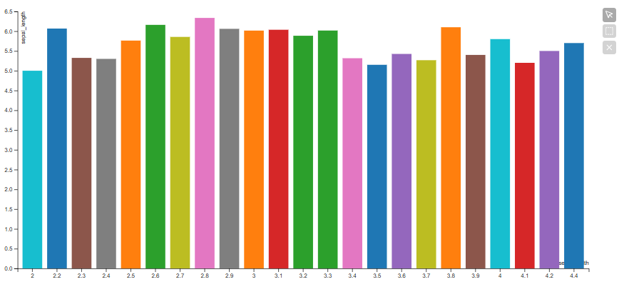

# BarPlot

Todos los ejemplos usan el dataset de Iris proporcionado por la libería Seaborn.



```python
from vizproo import BarPlot
barplot = BarPlot(data=iris, x='SepalWidth', y='SepalLength')
barplot
```