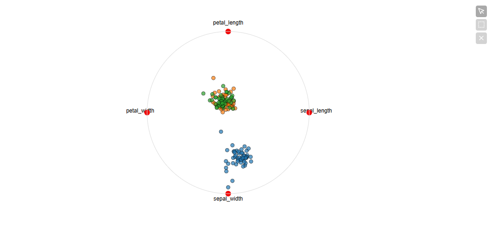

# RadViz

Todos los ejemplos usan el dataset de Iris proporcionado por la libería Seaborn.



```python
from vizproo import RadViz
plot1 = RadViz(data=iris, dimensions=['sepal_length','sepal_width','petal_width','petal_length'], hue='species')
plot1
```