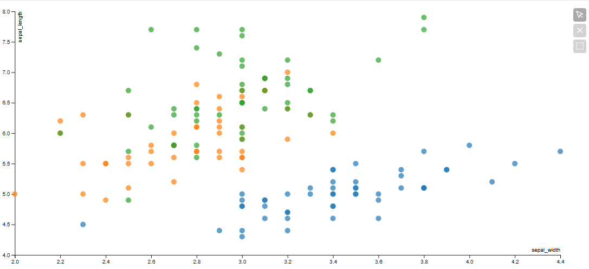

# BarPlot

Todos los ejemplos usan el dataset de Iris proporcionado por la libería Seaborn.



```python
from vizproo import ScatterPlot
scatterplot = ScatterPlot(data=iris, x='sepal_width', y='sepal_length', hue='species')
scatterplot
```